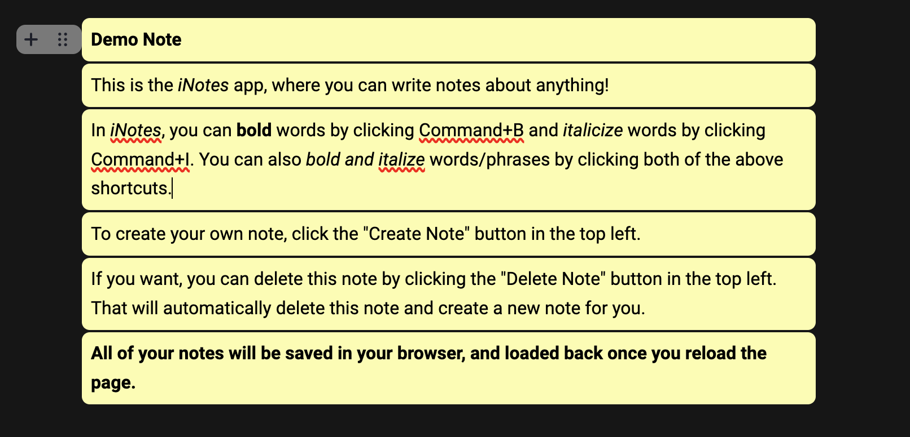

# Notes (Web App)
Similar to a phone or laptop's notes app, this web app allows you to write notes about anything!  
Notes are stored in the browser's local storage (not sent to a cloud) and automatically load back onto the page when requested.
 

Users are able to edit their notes to add sections with various amounts of text. This text will be saved locally on their browsers.
 
 

Users are able to browse through their previous notes, read, and edit them through the bar at the bottom of the page.
 
 

Users can also create new notes or delete the focused note using the buttons at the top of the page.
 
 

### View website at https://zayndamji.github.io/notes-webapp/

# Full Page Demo

 